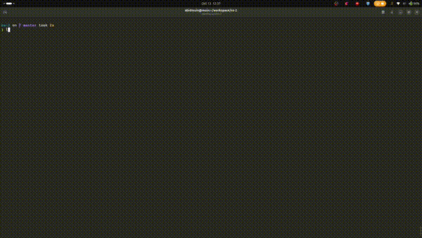

# Run NS-2.35 in Docker with Full NAM GUI (X11 Support)

**Run Network Simulator 2 (NS-2.35) with NAM GUI inside Docker. Zero setup, 100% reproducible. Perfect for students, researchers, or legacy network labs.**

**Network Simulator 2 (NS-2.35)** is a popular discrete event simulator for network research, but it often fails to compile on modern systems. This Docker image provides a plug-and-play environment with full GUI support, eliminating the setup hassle.

## Project Stats

       [](LICENSE)

## Table of Contents

- [Quick-start](#quick-start-1-minute-setup)
- [Features](#features)
- [Usage Options](#quick-start-two-ways-to-use-ns-2)
- [Running Simulations](#running-simulations)
- [Wayland Support](#wayland-support-x11-via-xwayland)
- [Project Structure](#project-structure)
- [Why Use Docker for NS2?](#why-use-docker-for-ns2)
- [Troubleshooting](#troubleshooting)
- [Maintainer](#maintainer)
- [Show Your Support](#show-your-support)
- [Credits](#credits)
- [License](#license)

## Quick-start (1-Minute Setup)
By default, the host directory for ns-2 script is `$HOME/workspace/ns-2/scripts`. If the directory is not present in your machine, the following command will create one for you and it will be auto mounted to `/root/scripts` in the container.
>Note: NAM uses a GUI. Ensure your system supports X11 forwarding (e.g. X11/XWayland on Linux).

On your host machine:
```sh
docker pull abidmuin/ns-2.35 && \
git clone https://github.com/abidmuin/ns-2.git && \
cd ns-2 && \
mkdir -p $HOME/workspace/ns-2/scripts && \
chmod +x run-ns2.sh && \
./run-ns2.sh \
```
Then, inside the container:
```sh
cd /root/scripts
ns sample.tcl && nam out.nam
```

### NAM GUI Running in Docker



> NAM GUI displaying a running simulation inside Docker with X11 forwarding.

---

## Features

- Pre-configured **NS-2.35** with **NAM GUI**.
- Lightweight Docker container.
- GUI support even on **Wayland** via **X11 forwarding**.
- Mount host directory to `/root/scripts` for running your `.tcl` or `.cpp` script simulations.
- Includes patch for known `ls.h` compilation issue.
- Two usage options: pre-built image or build it yourself.

---

## Usage Options: Two Ways to Use NS-2


<details>
<summary><strong> Option 1: Use Pre-Built Docker Image (Recommended)</strong></summary>

1. Pull the image from Docker Hub
```sh
   docker pull abidmuin/ns-2.35
```

2. Clone this repo to get the run script
```sh
    git clone https://github.com/abidmuin/ns-2.git && cd ns-2
```

3. Run NS2 with GUI support
```sh
    ./run-ns2.sh
```
This script will:
- Grant X11 access for GUI (NAM)
	- Mounts your local `$HOME/workspace/ns-2/scripts` directory into the container at `/root/scripts` for easy access to simulation files. The location can be modified in the `run-ns2.sh` script by changing `HOST_SCRIPTS_DIR` value.

</details>

<details>
<summary><strong> Option 2: Build the Image Locally</strong></summary>

1. Clone the repository
```sh
    git clone https://github.com/abidmuin/ns-2.git && cd ns-2
```

2. Build the image
  
```sh
    docker build -t abidmuin/ns-2.35 .
```

3. Run it

```sh
    ./run-ns2.sh
```

</details>

---

## Running Simulations

A working `sample.tcl` is included in the `scripts/` directory for testing.

Inside the container:
```sh
cd /root/scripts
```

```sh
ns sample.tcl && nam out.nam
```

All your `.tcl` or `.cpp` simulation scripts go into your host-side directory: `$HOME/workspace/ns-2/scripts`

## Wayland Support (X11 via XWayland)

Even if your host uses Wayland (`echo $XDG_SESSION_TYPE` returns `wayland`), the container uses **X11 via XWayland**, and GUI applications like **NAM** work as expected.
GUI access is granted using `xhost`.

```sh
xhost +local:root
docker run ...
xhost -local:root
```

This is already handled in `run-ns2.sh`. If NAM fails to launch, ensure `xhost +local:root` was successful and your Docker host allows X11 forwarding.

>Note: `xhost +local:root` is required for GUI apps in Docker, but remember to run `xhost -local:root` afterward to restore security.

## Project Structure

```sh
.
├── Dockerfile           # Docker build script
├── run-ns2.sh           # Launch script (GUI + mount setup)
├── README.md            # You're reading it!
└── scripts/             # (Optional) Your simulation scripts
```

## Why Use Docker for NS2?

| Without Docker           | With Docker                  |
| ------------------------ | ---------------------------- |
| Old GCC, OTcl, Tk issues | Pre-installed & configured   |
| Platform-specific bugs   | Works on any Docker platform |
| GUI breaks on Wayland    | GUI patched & tested         |
| Manual patching required | Auto-patched in Dockerfile   |
## Troubleshooting

- **NAM doesn’t launch / GUI errors**
  - Make sure X11 forwarding is working and `xhost +local:root` was successful.
  - On Wayland, ensure you have XWayland installed.

- **Permission denied when mounting host directory**
  - Try running with `sudo`, or ensure your user has Docker permissions.

## Maintainer

**Abid Hasan Muin**  
Email: `muin.739@gmail.com`  
[](https://github.com/abidmuin)  
[](https://hub.docker.com/r/abidmuin/ns-2.35)

Feel free to open an issue if you encounter any problem or have suggestions.

## Show Your Support

If this project saved you time or simplified your workflow, feel free to:
- Star this repo.
- Share it on LinkedIn or with your classmates/research group.

## Credits

- Original NS2 Source: [SourceForge](https://sourceforge.net/projects/nsnam) and [ISI](https://www.isi.edu/websites/nsnam/ns/)
- Sample TCL script: [Mark Greis' Tutorial](https://www.isi.edu/websites/nsnam/ns/tutorial/examples/example1b.tcl)
- Patches & Docker Integration: [@abidmuin](https://github.com/abidmuin)

## License

This project is licensed under the [MIT License](LICENSE).
